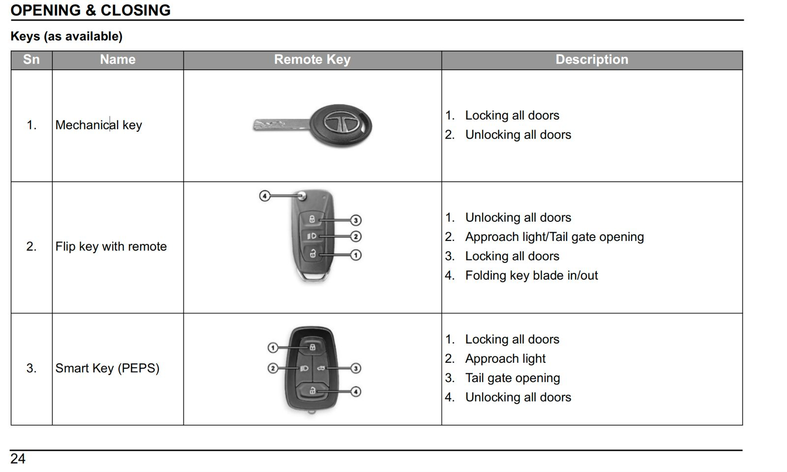
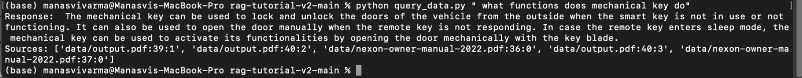
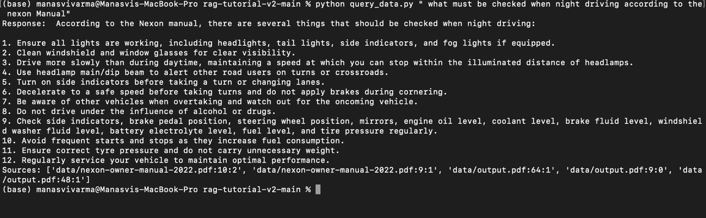
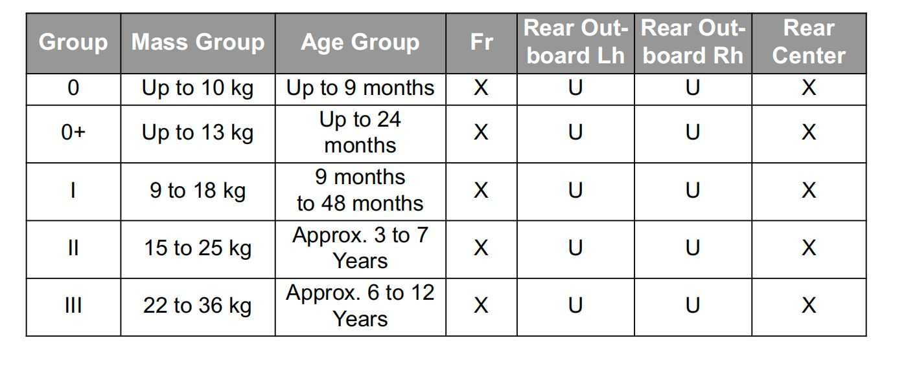
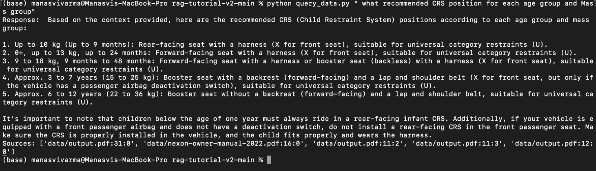
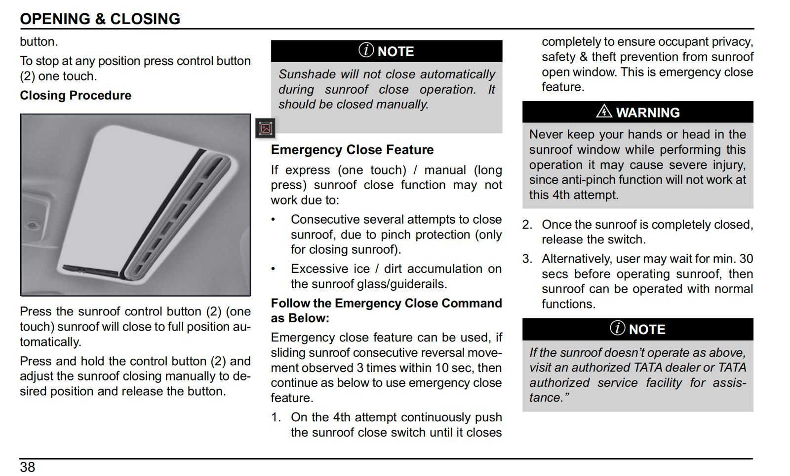
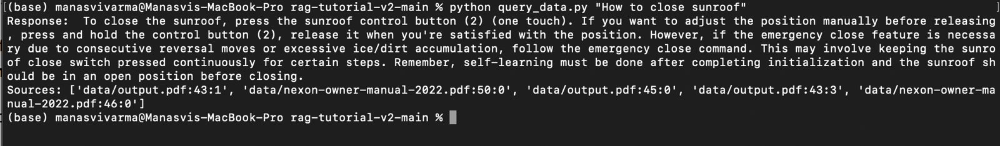

# Phase 1 Submission

## Metrics

- _Average Time to respond to given Query:_ less than 40 seconds
- _Extraction of PDF (241 pages) from the given manual:_ 2 mins 35 secs

  | Task                                                                     | Time          |
  | ------------------------------------------------------------------------ | ------------- |
  | Average Time to respond to given Query                                   | < 40 secs     |
  | Extraction of PDF (including table detection for every page + 241 pages) | 2 min 35 secs |
  | Extraction of PDF (plain text extraction + 241 pages)                    | 15 secs       |

## Pipeline Components

### 1. Extractor File

The extractor file efficiently extracts text and tables from PDF documents, optimizing the process by:

- Utilizing bounding box detection and grouping algorithms (column_boxes) to accurately identify text regions.
- Extracting Tables and Text data simultaneously.
- Normalizing extracted text for better LLM results.

### 2. ChromaDB

ChromaDB serves as a vector store to store word embeddings.

### 3. RAG Model

The RAG model is the core component of the pipeline:

- It combines retrieval and generation techniques to answer user queries.
- Performs similarity checks between the user query and multiple PDFs, generating a ranking of top K Documents.
- Returns a summarized answer along with links to paragraphs and page numbers in the manual.

### 4. Local LLM (Mistral)

Mistral is a local language model designed for low latency. It generates summarized outputs by condensing relevant information from paragraphs identified by the RAG model.

## How to Run

### Extractor

To run the Extractor, execute each cell in the extractor.ipynb file.

### RAG Model

#### Download Dependencies:

- Install the Local Ollama Model from [Ollama](https://ollama.com/).
- Then run ollama run mistral.

#### To Run the Model:

- Execute python populate_database.py.
- Execute python query_data.py "{YOUR QUERY}".

## Results

| Expected Image                               | Result Image                       |
| -------------------------------------------- | ---------------------------------- |
|  |   |
|  |   |
|  |   |
|  |   |
